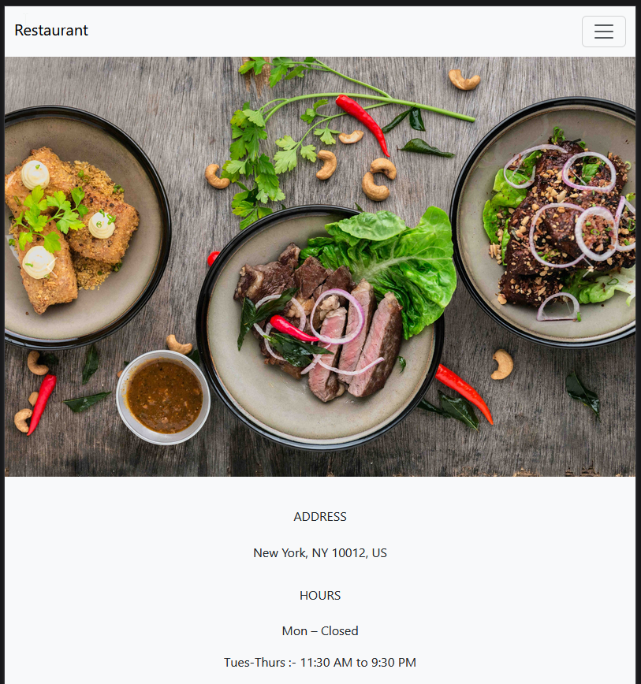
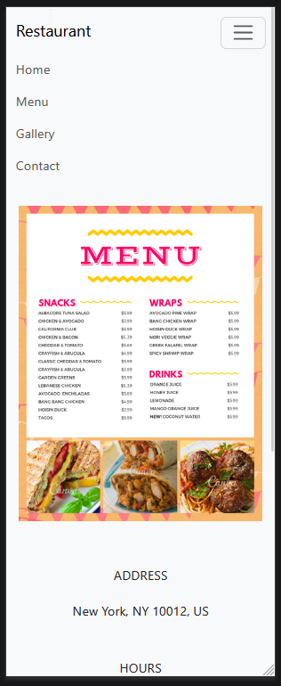
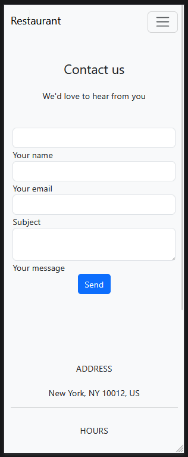
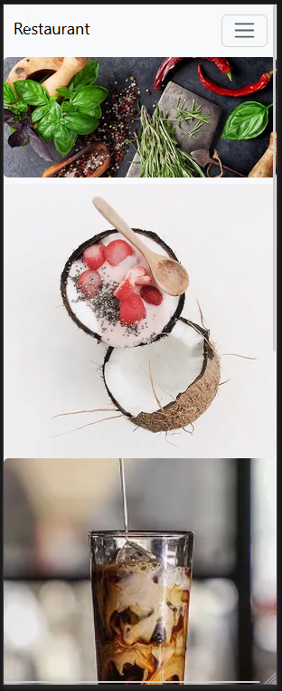

# vue-restaurant-project
This is a mock restaurant website built in VueJS and Bootstrap with basic routing. Hosted for viewing at https://thecountofperu.github.io/vue-restaurant-project.

## Project Setup

```sh
npm install
```

### Compile and Hot-Reload for Development

```sh
npm run dev
```

### Compile and Minify for Production

```sh
npm run build
```

### Screenshots






